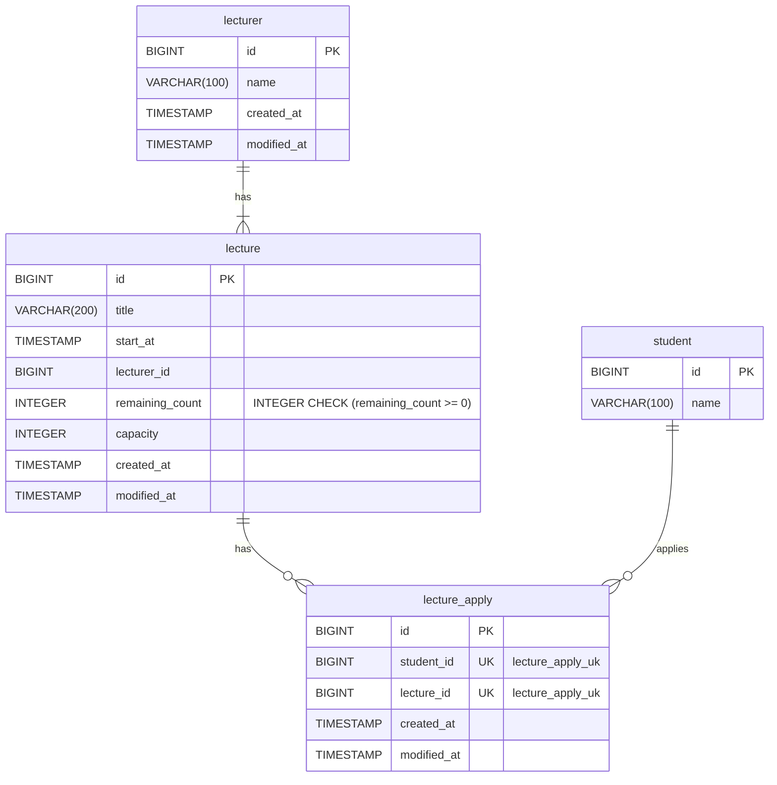

## ERD



### [1] FK 를 선언하지 않은 이유
- FK 설정은 락의 연관성으로 인해 성능, 동시성 문제를 야기할 수 있다. 또한, 조인 성능에 관한 이슈는 별도의 인덱스를 선언해 해결 가능하다고 판단했다.
    ```
    [FK 장점]
    1. 데이터 무결성 보장과 일관성 유지, 자동 데이터 갱신 관리(e.g. CASCADE) 를 보장한다.
    2. FK 를 참조하는 테이블은 index 가 생성되어 join 연산을 실행할 때, 조인 성능을 향상시킨다.
    
    [FK 단점]
    1. 잠금 전파 : FK 제약 조건 설정된 경우, 부모-자식 테이블 간의 데이터 일관성을 위해 테이블에 잠금을 확장한다. DML 및 DDL 작업이 동시에 실행되는 것을 방지하기 위함이다.
    2. 데드락 발생 가능성 : FK 는 부모 테이블이나 자식 테이블에 데이터 존재를 확인하는 작업이 필요해 잠금이 여러 테이블로 전파되어 데드락이 발생활 확률 높다.
    ```

### [2] 강의 시작 시간을 timestamp 를 선언
- datetime 은 timezone 과 연관이 없는 반면, timestamp 는 타임존을 고려한다. 입력된 시간을 UTC 로 변환 저장하고, DB 서버의 timezone 에 맞게 
  변환된다. 정확한 현지 시간을 반환하기 때문에 수강 신청 도메인의 경우에는 다른 지역에서 동일한 시간 정보 조회가 필요하다고 생각했다.

### [3] 강의 잔여 좌석에 CHECK 제약 사항 + 강의 신청 식별을 위한 UK 선언
- 애플리케이션에서 비즈니스 제약 사항을 설정하는 경우, 멀티스레드 환경에서 데이터 정합성(e.g. CPU Cache) 문제로 인해
  추가 강의 신청자가 발생할 수 있을 것이라 생각했다. 이를 방지하기 위해 DB 에서 제약사항을 처리하는 것이 필요하다고 생각하여 제약사항을 추가했다.
- 제약 사항의 경우, 단일 인스턴스 환경에서 volatile 을 사용해 정합성 문제를 해결 가능하다.
  하지만 다중 인스턴스 환경에서는 적합한 방법은 아니기 때문에 제약사항을 관리하기 위한 단일 지점이 필요하다고 생각했다.

## Reference

- [mysql docs] foreign-key-locking : https://dev.mysql.com/doc/refman/8.0/en/create-table-foreign-keys.html#foreign-key-locking
- [mysql docs] The DATE, DATETIME, and TIMESTAMP Types : https://dev.mysql.com/doc/refman/8.0/en/datetime.html
